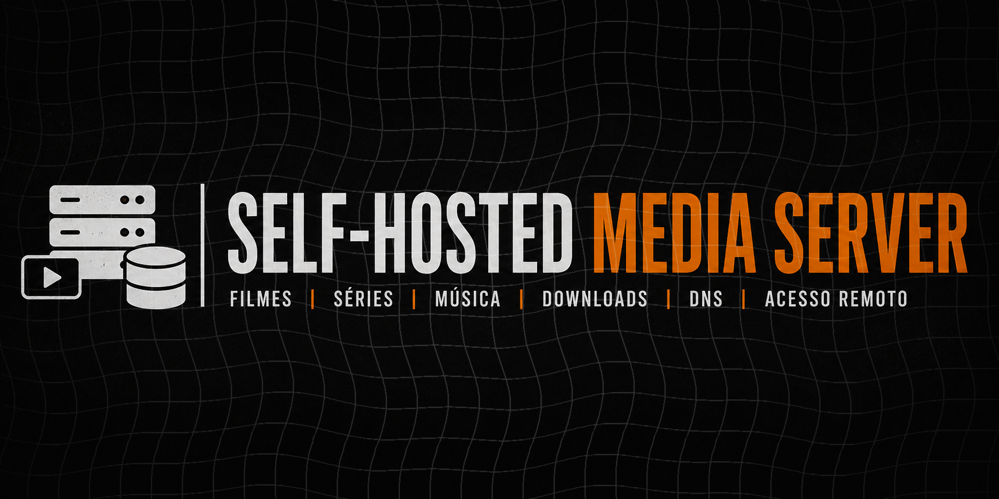

<div align="center">
  
</div>

<div align="center">

---


Servidor de mídia **self-hosted** executado em Linux utilizando Docker e Docker Compose.

O projeto reúne serviços para gerenciamento e reprodução de:

* 🎬 Filmes
* 📺 Séries
* 🎵 Música
* ⬇️ Downloads
* 🛡️ DNS / Bloqueio de anúncios
* 🔗 Acesso remoto

O objetivo é construir uma infraestrutura de mídia pessoal utilizando **containers, volumes persistentes, organização de arquivos, acesso remoto e serviços independentes**.

---

## 🏗️ Arquitetura

```text
                         ┌─────────────────┐
                         │     Usuário     │
                         └────────┬────────┘
                                  │
                    ┌─────────────┼─────────────┬─────────────┐
                    │             │             │             │
                    ▼             ▼             ▼             ▼
                Jellyfin      Navidrome     qBittorrent    AdGuard Home
                  :8096          :4533          :8080         :3000
                    │             │             │           (DNS: 53)
                    │             │             ▼
                    │             │          Downloads
                    │             │             │
                    │             │             ▼
                    │             │      /opt/jellyfin/media
                    │             │
                    │             ▼
                    │      /opt/navidrome/music
                    │
                    ▼
              Filmes / Séries
```

Acesso remoto entre dispositivos via **Tailscale**, sem expor portas diretamente na internet.

---

## 📦 Serviços

| Serviço      | Função                     |          Porta | Documentação                        |
| ------------ | --------------------------- | --------------: | ------------------------------------ |
| Jellyfin     | Filmes e séries              |          `8096` | [docs/jellyfin.md](docs/Jellyfin.md)   |
| Navidrome    | Servidor de música            |          `4533` | [docs/navidrome.md](docs/Navidrome.md) |
| qBittorrent  | Gerenciamento de downloads    |          `8080` | [docs/qbittorrent.md](docs/Qbittorrent.md) |
| AdGuard Home | DNS e bloqueio de anúncios    | `53` / `3000` | [docs/adguard.md](docs/Adguard.md)     |
| spotDL       | Download manual de músicas    |             CLI | [docs/navidrome.md](docs/Navidrome.md) |
| Tailscale    | Acesso remoto privado         |               — | [docs/tailscale.md](docs/Tailscale.md) |
| Dozzle       | Monitoramento de containers   | `9999`          | [docs/tailscale.md](docs/Dozzle.md) |

---

## 📁 Estrutura do Projeto

```text
media-server/
│
├── jellyfin/
│   ├── docker-compose.yml
│   ├── config/
│   ├── cache/
│   └── media/
│
├── qbittorrent/
│   ├── docker-compose.yml
│   └── config/
│
├── navidrome/
│   ├── docker-compose.yml
│   ├── data/
│   └── music/
│
├── adguard/
│   ├── docker-compose.yml
│   ├── work/
│   └── conf/
│
├── docs/
│   ├── docker.md
│   ├── jellyfin.md
│   ├── navidrome.md
│   ├── qbittorrent.md
│   ├── adguard.md
│   ├── tailscale.md
│   └── troubleshooting.md
│
├── .gitignore
└── README.md
```

> As pastas de configuração, banco de dados, cache e mídia não são versionadas — ver [.gitignore](.gitignore).

---

## 📋 Requisitos

* CPU x86_64
* 4 GB de RAM ou mais
* SSD para o sistema e containers
* HD/SSD para armazenamento de mídia
* Conexão de rede local
* Linux + Docker + Docker Compose

Guia completo de instalação do Docker: [docs/docker.md](docs/docker.md)

---

## 📚 Documentação detalhada

* [🐳 Instalação do Docker](docs/Docker.md)
* [🎬 Jellyfin](docs/Jellyfin.md)
* [🎵 Navidrome + spotDL](docs/Navidrome.md)
* [📥 qBittorrent](docs/Qbittorrent.md)
* [📊 Dozzle](docs/Dozzle.md)
* [🛡️ AdGuard Home](docs/Adguard.md)
* [🔗 Acesso remoto com Tailscale](docs/Tailscale.md)
* [🔍 Verificação e Troubleshooting](docs/Troubleshooting.md)

---

## 🔐 Segurança

Evite expor diretamente serviços administrativos para a internet (`8080` qBittorrent, `3000` AdGuard Home). Prefira Tailscale, VPN, reverse proxy com HTTPS e firewall.

Nunca versionar: senhas, tokens, API keys, `.env`, `config/`, `data/`, `cache/`, `work/`, config real do AdGuard, bancos de dados, mídia.

---

## 🧠 O que este projeto demonstra

Linux · Docker · Docker Compose · Volumes e persistência de dados · Administração de servidores · DNS e bloqueio de anúncios · Git/GitHub · Self-hosting · Redes e acesso remoto · Troubleshooting

---

## 🗺️ Roadmap

* [ ] Integrar **Lidarr** para gerenciamento automático da biblioteca musical
* [ ] Configurar **reverse proxy + HTTPS**
* [ ] Implementar **backup das configurações**
* [ ] Regras de DNS rewrite / listas de bloqueio personalizadas no AdGuard Home

---

## ⚠️ Aviso

Este projeto é destinado a aprendizado, administração de servidores e gerenciamento de mídia que o usuário possui ou tem autorização para armazenar. O responsável pela implantação deve verificar as leis e os termos de serviço aplicáveis ao conteúdo utilizado.
